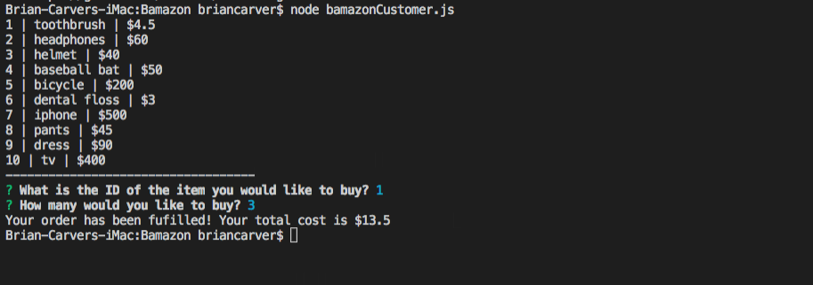
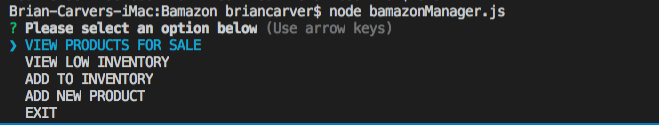
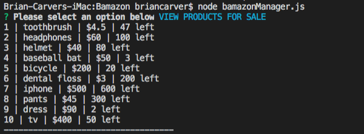
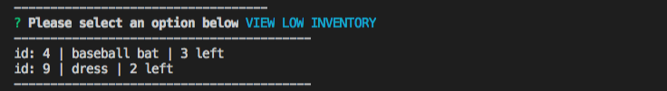
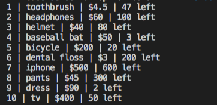
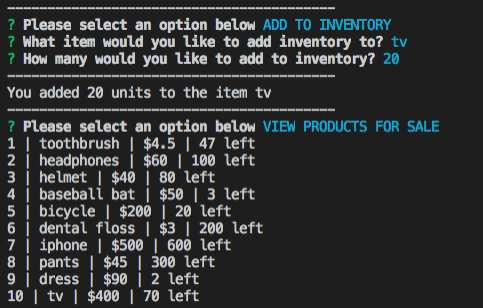
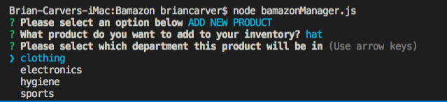
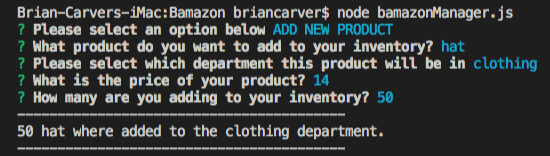
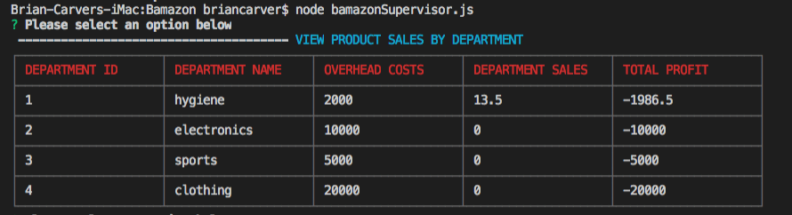
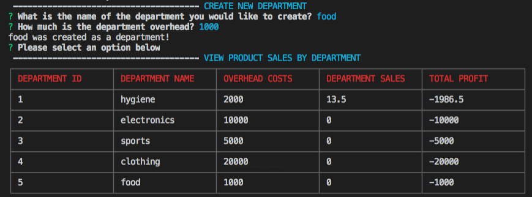

# BAMAZON 

* This is a command line application that can be used by a customer to purchase items. There are also features that allow managers and supervisors to view and manage inventory.

* To get started initialize your `package.json` by running `npm init` in your application's folder

* Once a `package.json` has been created run `npm install` to import modules.

* A sample database is provided within the bamazon.sql file.

### CUSTOMER VIEW

* type "node bamazonCustomer.js" to initalize app

* Select the item you would like to purchase by entering the 'id' number in the prompt
  Select the quantity you would like to purchase by entering the number in the prompt
  Bamazon will return the total cost of your order
  
  (3 toothbrushes have been purchased)
  

### Manager View

* type "node bamazonManager.js" to initialize manager view

* Select an action from the prompt list

 
####### View Products for Sale

* This will display your products and inventory. 

  (3 toothbrushes have been deducted from the total inventory of 50)
  

####### View Low Inventory

* This will display items that are currenlty below 5 in stock.

###### Add to Inventory

* Type in the name of the item you would like to add inventory to followed by the quantity to add.

(before addition)

(after addition)

####### Add new product

* This will return a series of prompts that will allow you to add an item to inventory.

* The item must belong to a already existing department (choices provided). Use the supervisor app to    add a new department to the store.
 

### Supervisor View

* type "node bamazonSupervisor.js" to initialize supervisor view

* Select an option from the prompt

###### View Products Sales by Department

(3 toothbrushes were purchased in the previous example.)

####### Create New Department

* Follow the prompts to create a new department. Select 'VIEW PRODUCT SALES BY DEPARTMENT'  to view your new department.

